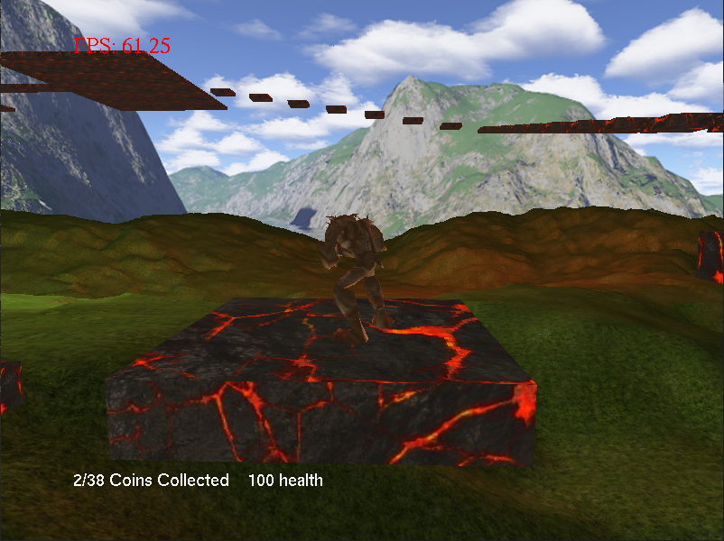

## RT3D Assignment
3D platformer developed for a module at University

## Build instructions
Install [vcpkg](https://vcpkg.io/en/) and run the following command to install library dependencies:

 ```
vcpkg install freeglut sfml
 ```

 Then cd into the project root folder and run the following cmake commands:
 ```
cmake -B build -S . -DCMAKE_TOOLCHAIN_FILE=<path_to_vcpkg_dir>\scripts\buildsystems\vcpkg.cmake
cmake --build build --config Release
 ```

Replacing the <path_to_vcpkg_dir> with the path to your vcpkg installation folder. This will place the executable and resource files into the /build/Release/ folder. You can build the Debug build by specifying --config Debug instead.

## Screenshots





